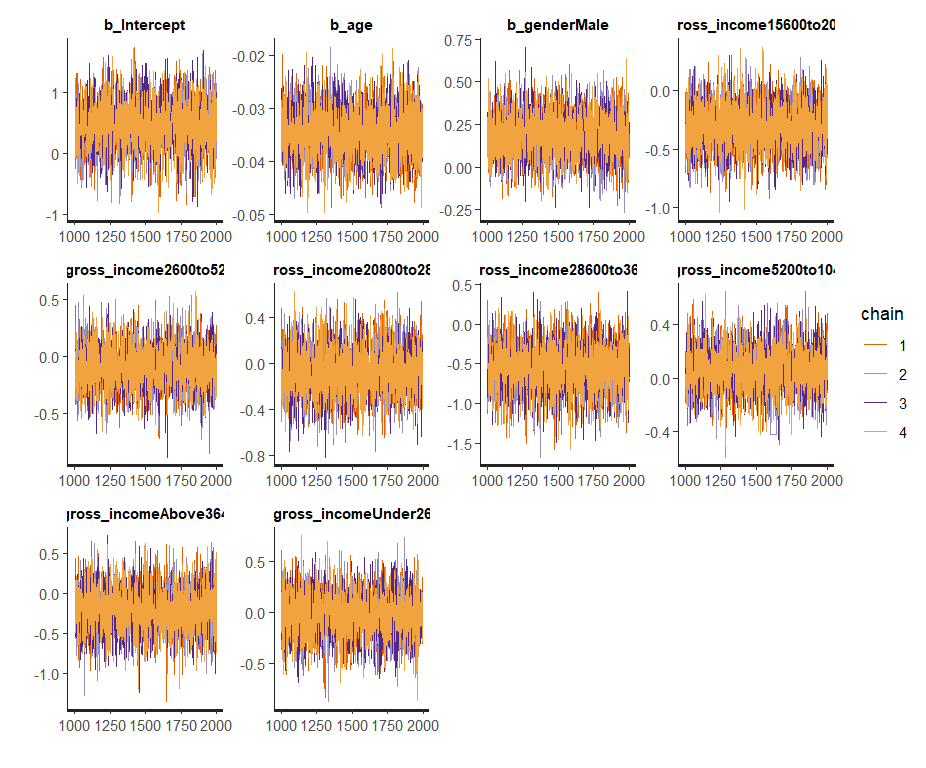
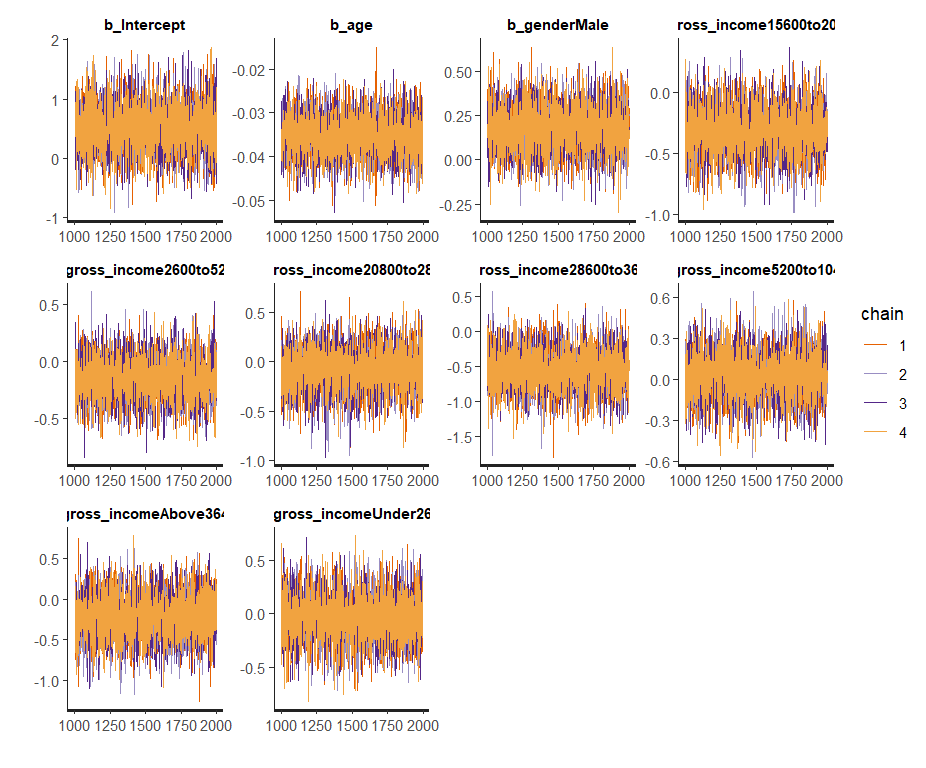
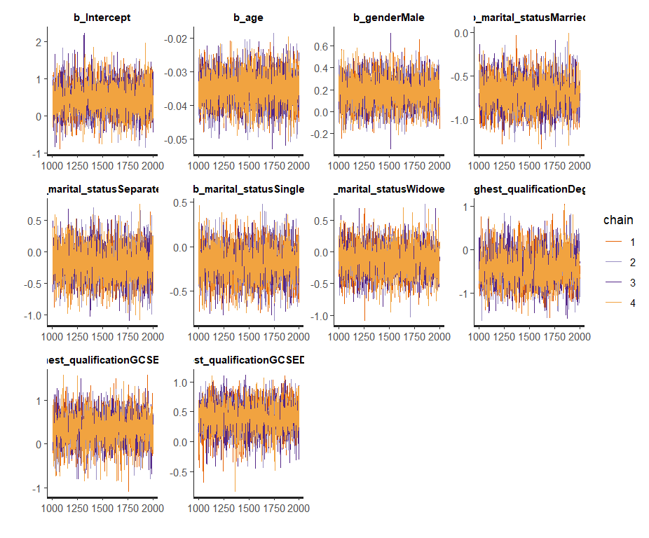

# Bayesian Approach For Smoking Prediction


## Introduction
Smoking remains a significant global public health problem. This study addresses the prediction of smoking behavior using individual-level factors (age, gender, income) and regional variation. We propose three Bayesian hierarchical models to disentangle the determinants of smoking.

## Data
The dataset, sourced from Kaggle ([source](https://www.kaggle.com/datasets/mohibali/smoking-data-from-uk)), includes 1691 observations with demographic and socioeconomic variables. Preprocessing involved removing incomplete entries and converting categorical variables to factors.

### Demographic Distribution
  


## Models
### Model 1: Random Intercept for Region
Predicts smoking status using age, gender, income, and a regional random intercept.  
**Formula**:
```r
smoke ~ age + gender + gross_income + ... + (1 | region)
```

### Model 2: Random Slope for Education by Region
Adds region-specific slopes for education.  
**Formula**:
```r
smoke ~ age + gender + ... + (0 + highest_qualification | region)
```

### Model 3: Random Intercept and Slope
Combines random intercept and slope for education by region.  
**Formula**:
```r
smoke ~ age + gender + ... + (1 + highest_qualification | region)
```

## Priors
- **Fixed effects**: `Normal(0, 0.5)`  
- **Age coefficient**: `Normal(0, 0.02)`  
- **Intercept**: `Student-t(3, 0, 5)`  
- **Random effects**: `Student-t(3, 0, 2.5)`  
- **Correlation**: `LKJ(2)` for Model 3.

## Code
### Model 1
```r
model1 <- brm(
  formula = smoke ~ age + gender + ... + (1 | region),
  data = data,
  family = bernoulli(),
  prior = c(...)
)
```

### Model 2
```r
model2 <- brm(
  formula = smoke ~ age + ... + (0 + highest_qualification | region),
  ...
)
```

### Model 3
```r
model3 <- brm(
  formula = smoke ~ ... + (1 + highest_qualification | region),
  prior = c(..., prior(lkj(2), class = "cor")
)
```

## Convergence Diagnostics
All models showed R̂ ≈ 1, indicating convergence. Trace plots and posterior predictive checks validated reliability.


## Model Comparison
### LOO Results
| Model | elpd_loo | looic  |
|-------|----------|--------|
| 1     | -818.4   | 1637.6 |
| 2     | -816.8   | 1633.5 |
| 3     | -816.4   | 1632.8 |

**Conclusion**: Model 3 (random intercept + slope) performed best.

## Limitations
- Excluded "unknown" responses may bias results.
- Complex relationships might require advanced techniques (e.g., deep learning).

## Conclusion
Model 3 effectively captures regional and educational influences on smoking, offering the best predictive accuracy.

---

### Highlights:
- **Bayesian Focus**: Leverages hierarchical modeling to capture regional and individual effects.
- **Reproducible**: Includes R scripts, preprocessed data, and model outputs.
- **Visual-Driven**: Uses plots to highlight demographic trends and model diagnostics.
- **Practical**: Code and report provide a template for Bayesian public health analytics.
- 
## Appendix
### Trace Plots
  
  


### Regression Coefficients (Model 1)
| Variable               | Estimate (95% CI)        |
|------------------------|--------------------------|
| Intercept              | 0.45 (-0.35, 1.21)      |
| age                    | -0.03 (-0.04, -0.02)    |
| genderMale             | 0.19 (-0.07, 0.45)      |
| ...                    | ...                      |

---


